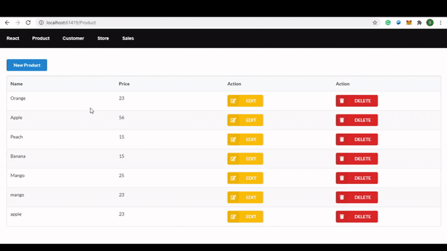

# React CRUD Application

Steps: 
1. clone this in visual studio 2017
2. open project folder in cmd
3. 'npm install'
4. 'npm run start'
5. now run project from visual studio enjoy!!

## Project View

